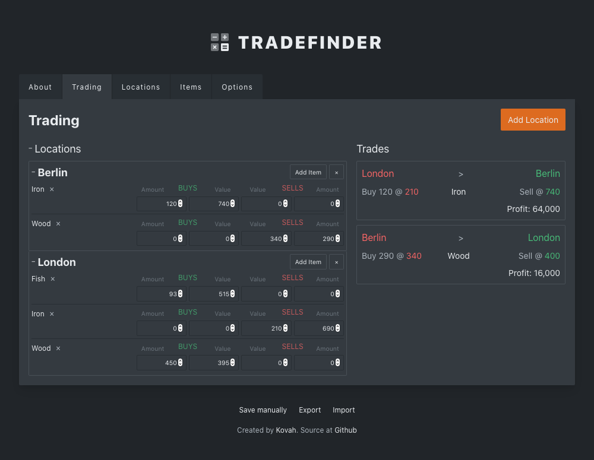

# Tradefinder

A web tool to find the most profitable trades between two merchants. Perfect for gamers. 🎮




## About

The Tradefinder is web tool to find the most profitable trades between two locations, where one is selling a good and another is buying that good at a higher price. Additionally, you may specify the amount that can be bought or sold. Trades which are not profitable are discarded.

I built this tool to scratch my own itch because I felt it super difficult to keep track of prices and amounts for trading between cities (Windward) or space stations (No Man's Sky).


### How to use the Tradefinder

Opening the tool for the first time will add some example locations and some items to it, so you start experimenting right away.  
After adding a location to the trading overview, you can add items to that location. Once added, you can start editing the amounts or prices. If an item is not sold or bought, simply leave the amount and value at zero.  
Once you added at least two locations with the same item, the Tradefinder will calculate the possible trades. If a profitable trade (profit > 0) is found, it will be displayed in the trades overview on the right side.


## Development Setup

The web tool is built using React and Tailwind CSS. Bundling is done via Parcel.

```
npm install
npm run serve
```

You can now access the tool via `http://localhost:1234`.

---

Tradefinder is a project by [Kovah](https://kovah.de)  and [Contributors](https://github.com/Kovah/Tradefinder/graphs/contributors)
